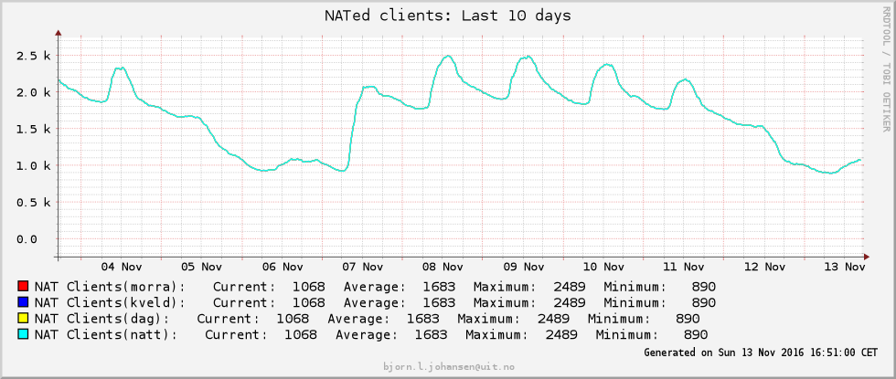
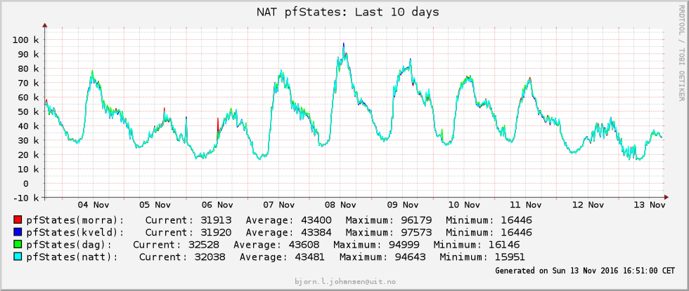

title: Test
layout: true
<div class="my-header"></div>

---


class: middle, center
# Home-made enterprise/CG-NAT at UiT

### Bjørn Johansen <bjorn.l.johansen@uit.no>
---

exclude: true
# Agenda
- Outline
- Components
- Wiring
- Configuration
- Uses

---

# Rationale and outline
- RFC1918-adresses in use on 4 major campuses
    - All from 10.0.0.0/8 without any particular limitation
- Need for solution to cope with expansion and segregation of networks, particularly wireless
- Need for some way of giving primitive IoT-devices temporary or permanent internet access

- Existing solutions available not suitable for our purpose
- Cheap(~90k NOK) solution with geo-redundancy and 10Gbps capacity(potential for bundling to approx 20Gbps with current hardware)
- 1U Dell PowerEdge R430 in two datacenters with 

---

# Components
- Core routers
    - Cisco Catalyst 6880X-LE
- Plain(1U Pizzabox) server hardware
    - Dell PowerEdge R430
- OpenBSD
    - 5.9 (5.8)
- CARP/HSRP

---

# Wiring
- Network infrastructure
    - Two core routers connected with both L2 and L3
	- Ie. Two main NAT appliances, one at each router
	- Shared interfaces(HSRP) on shared L2 (wireless default gateways, ingres/egress NAT)
	- Other campuses connected via MPLS and internal routing
	- Policy-based routing to steer traffic into the appliances
	    - Both on core routers and on remote campuses

- Appliance at each core router
    - Kept in sync over a dedicated VLAN for pfSync
    - All appliances in a "cluster" share the same IP-address over CARP
    - "99 bottles of NAT on the wall"

???
Insert notes here

---

#Configuration(routers)
- Policy rule on routers
    - ```terminal
route-map nat-openBSD permit 10
 match ip address nat-tromso.acl
 set ip next-hop 10.249.2.9
!
```
    - ```terminal
...
remark -- Wifinett for eksterne i TromsC
 permit ip 10.239.144.0 0.0.15.255 any
 remark -- Wifinett for eksterne i Alta
 permit ip 10.239.160.0 0.0.7.255 any
 remark -- Wifinett for eksterne i Narvik
 permit ip 10.239.168.0 0.0.7.255 any
 remark -- Wifinett for ekstrne i Harstad
 permit ip 10.239.176.0 0.0.7.255 any
...
```

---

#Configuration(OpenBSD/pf)
- Plain pf configuration(with OpenBSD spice)
    - ```terminal
wifi_eksterne_tromso="10.239.144.0/20"
...
outside_eksterne_tromso="129.242.224.16/28"
...
```
    - ```terminal
match out on $NATout_if inet from $wifi_eksterne_tromso  nat-to $outside_eksterne_tromso  source-hash 0xe8ee8b726e92ee3c1a4124c06ae8241d
```
- logging of pflog to central syslog
- Custom SNMP OID's
	- Export
		- Translations per second
		- Current number of states
		- etc
	- Plans for use of UiT PEN assigned by IANA

---

#Configuration(Failover/Redundancy)
- Routers operate in HSRP
    - For both ingress and egress addresses
    - Current setup with appliances directly connected to routers
- NAT appliances operate in CARP with pfSync
    - Primary appliance at primary router
    - Degrades both ingress and egress interfaces upon maintainance or link down
    - States synced using pfSync(multicast) on separate VLAN
	- empty tables populated using request and rate limited sync
	- Allows for stateful switchover with only visible sign in traceroute
    - Allows for easy activation and deactivation of appliances
	- How current setup was put in production

---

#Statistics
- Peak of 120k translations/s on an average day
- Peak of 2.5k internal addresses translated
- Peak of 95k states on average day
- 99.2% idle :P
- 
-  

---

#"Sane" defaults
- Need to balance number of internal addresses per external addresses
    - Pools of addresses
    - Deterministic mapping of internal to external addresses
    - 256 internal addresses per external address = ~250 external ports per internal address

- Global maximum state count
    - Currently 250k, easy to extend

---

# Lessons learned and experiences
- Works great
    - POS most critical users
    - In use by clients, network infrastructure, building automation
- Test service suddenly in production
- Administration is nitpicking
- Configuration MUST be kept in sync between all appliances
    - source-hash must be the same to ensure the same external address is used after failover
---

# Future plans and improvements
- RESTful management
    - Integration into NAV DHCP module
	- Temporarily NAT individual adresses on demand
    - Eyecandy and dashboard
    - External Address usage
- automatic configuration revisioning using git

- Potential for small NUC appliance
- Usage within wireless/wired performance monitoring
    - Look at TCP restransmissions, ACKs

---

#Thank you!
- Questions?
